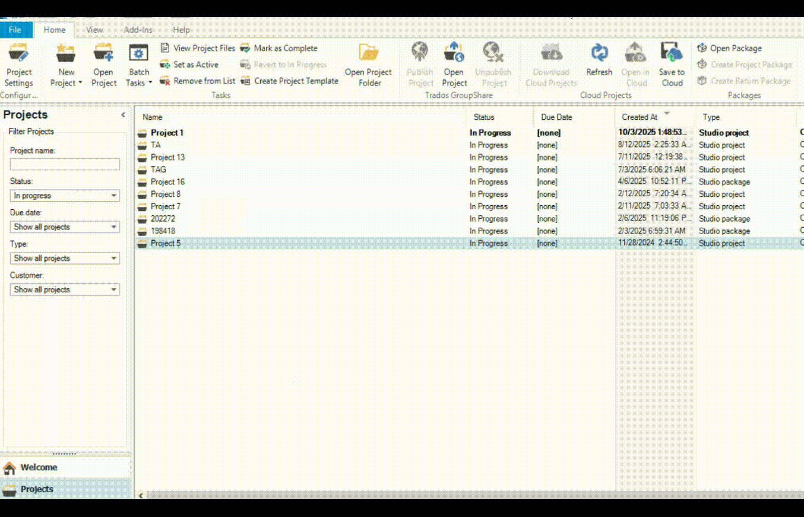

# BatchComplete for Trados Studio

A simple plugin to batch-complete your in-progress projects.

 

 

## The Problem

In Trados Studio 2021, you can only mark projects as "Complete" one by one from the "Projects" view. This is tedious if you have many small projects to close out at the end of the day or week.

## The Solution

This plugin adds a single command to the right-click menu. It allows you to select multiple "In-Progress" projects and mark them all as "Complete" with a single click, saving you time and effort.

If your selection includes a mix of project statuses (e.g., some are already "Completed") in the "Show all projects" view, it will automatically detect and process only the "In-Progress" projects. The confirmation message will always show the correct number of projects that will be affected.

## Installation

The recommended way to install this plugin is from the official **RWS AppStore**.
*(A link will be added here once the plugin is approved.)*

In the meantime, you can install it manually by downloading the `.sdlplugin` file from GitHub and double-clicking it.

## Usage

1.  Go to the **Projects** view in Trados Studio.
2.  Select two or more projects with the status "In-Progress."
3.  Right-click on your selection.
4.  Choose the new **"Mark as Complete (Batch)"** option from the context menu.

## Compatibility

This plugin has been developed and tested for **Trados Studio 2021**. Compatibility with other versions is not guaranteed at this time.

## Support & Suggestions

Find a bug or have an idea for an improvement? Please **[open an issue]** on this repository.

## License

This project is licensed under the MIT licence. See the `LICENSE` file for details.
